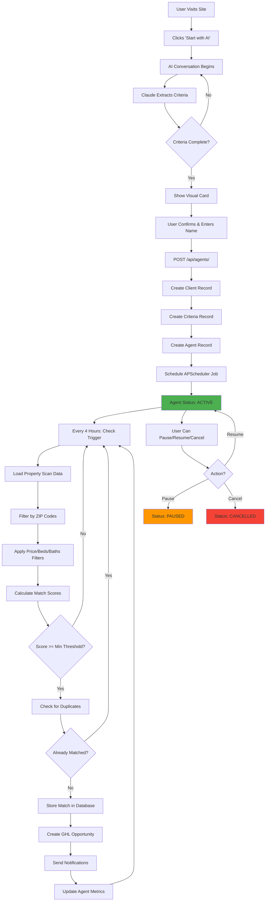

# DealFinder Pro - Autonomous Agent System v2.0

**Deep Dive into the AI-Powered Autonomous Property Monitoring System**

Last Updated: October 2025

---

## Executive Summary

DealFinder Pro's autonomous agent system is a **background intelligence layer** that continuously monitors property markets and delivers qualified matches to GoHighLevel without human intervention.

**Core Innovation:**
- Users configure agents via 3-minute AI conversation
- Agents run autonomously every 4 hours, 24/7
- Zero daily maintenance required
- Matches delivered directly to GoHighLevel CRM

---

## Table of Contents

1. [Agent Architecture Overview](#agent-architecture-overview)
2. [Agent Lifecycle](#agent-lifecycle)
3. [System Flowcharts](#system-flowcharts)
4. [Component Details](#component-details)
5. [Agent Intelligence](#agent-intelligence)
6. [Matching Algorithm](#matching-algorithm)
7. [GHL Integration Flow](#ghl-integration-flow)
8. [Monitoring & Health](#monitoring--health)
9. [Scaling & Performance](#scaling--performance)

---

## Agent Architecture Overview

### Three-Layer Architecture

```
┌─────────────────────────────────────────────────────────────┐
│                    USER INTERFACE LAYER                      │
├─────────────────────────────────────────────────────────────┤
│  Next.js Frontend (Port 3000)                               │
│  - Landing page with animations                             │
│  - AI setup wizard (conversational interface)               │
│  - Agent creation confirmation                              │
│                                                              │
│  FastAPI Backend (Port 8000)                                │
│  - REST API (21 endpoints)                                  │
│  - AI chat endpoint (/api/chat/)                            │
│  - Agent CRUD endpoints (/api/agents/)                      │
│  - WebSocket for real-time updates (future)                │
└─────────────────────────────────────────────────────────────┘
                            ↓
┌─────────────────────────────────────────────────────────────┐
│                 AGENT ORCHESTRATION LAYER                    │
├─────────────────────────────────────────────────────────────┤
│  Agent Manager (modules/agent_manager.py)                   │
│  - Lifecycle management (create, pause, resume, cancel)     │
│  - APScheduler integration (background jobs)                │
│  - Health monitoring and error recovery                     │
│  - Concurrent agent execution                               │
│  - State persistence (database)                             │
└─────────────────────────────────────────────────────────────┘
                            ↓
┌─────────────────────────────────────────────────────────────┐
│                   AGENT EXECUTION LAYER                      │
├─────────────────────────────────────────────────────────────┤
│  Search Agent (modules/search_agent.py)                     │
│  - Property data loading                                    │
│  - Criteria filtering (ZIP, price, beds, baths)            │
│  - Match scoring (0-100 algorithm)                          │
│  - Duplicate detection                                      │
│  - Match storage and history                                │
│  - Notification triggering                                  │
│                                                              │
│  AI Agent (modules/ai_agent.py)                             │
│  - Claude integration for setup                             │
│  - Natural language criteria extraction                     │
│  - Match reasoning generation                               │
│  - Quality scoring                                          │
└─────────────────────────────────────────────────────────────┘
                            ↓
┌─────────────────────────────────────────────────────────────┐
│                    DATA & INTEGRATION LAYER                  │
├─────────────────────────────────────────────────────────────┤
│  Database (database/dealfinder.db)                          │
│  - Clients, Criteria, Agents, Matches                       │
│  - SQLite (dev) / PostgreSQL (prod)                         │
│                                                              │
│  Property Scanner (modules/property_scanner.py)             │
│  - Realtor.com scraping (homeharvest)                       │
│  - Data enrichment and normalization                        │
│  - Latest scan storage (data/latest_scan.json)             │
│                                                              │
│  GHL Connector (integrations/ghl_connector.py)              │
│  - Opportunity creation API calls                           │
│  - Custom field mapping                                     │
│  - Workflow triggers                                        │
│  - Rate limiting (100 req/min)                              │
└─────────────────────────────────────────────────────────────┘
```

---

## Agent Lifecycle

### Complete Agent Journey



### State Machine

```
┌────────────┐
│   PENDING  │ (Initial state after creation)
└─────┬──────┘
      │ APScheduler job scheduled
      ↓
┌────────────┐
│   ACTIVE   │ ←──────┐
└─────┬──────┘        │ Resume
      │               │
      │ Check every 4h│
      │               │
      ├─→ Load data   │
      ├─→ Filter      │
      ├─→ Score       │
      ├─→ Store       │
      ├─→ Notify      │
      │               │
      │ User pauses   │
      ↓               │
┌────────────┐        │
│   PAUSED   │ ───────┘
└─────┬──────┘
      │ User cancels
      ↓
┌────────────┐
│ CANCELLED  │ (Terminal state - no longer checks)
└────────────┘

Alternative terminal states:
┌────────────┐
│ COMPLETED  │ (Manual completion by user)
└────────────┘
┌────────────┐
│   FAILED   │ (Unrecoverable error)
└────────────┘
```

---

## System Flowcharts

### 1. Agent Creation Flow (3 minutes)

```
┌──────────────────────────────────────────────────────────────┐
│                    AGENT CREATION FLOW                        │
└──────────────────────────────────────────────────────────────┘

USER ACTION                  SYSTEM PROCESSING
─────────────────────────────────────────────────────────────────

1. Land on homepage
   │
   ├─→ [Next.js renders landing page]
   │   - Animated hero section
   │   - "Start with AI" CTA button
   │
2. Click "Start with AI"
   │
   ├─→ [Route to /setup]
   │   - Load AI chat interface
   │   - Initialize conversation history
   │
3. AI greets user
   │
   ├─→ [POST /api/chat/]
   │   {
   │     "message": "",
   │     "conversation_history": []
   │   }
   │
   ├─→ [Claude generates greeting]
   │   "Hi there. I'm your Senior Acquisition
   │    Specialist. Let's configure your property
   │    search agent. What type of properties
   │    are you targeting?"
   │
4. User: "Investment properties in San Diego"
   │
   ├─→ [POST /api/chat/]
   │   - Claude processes natural language
   │   - Extracts: location = "San Diego"
   │   - Asks follow-up question
   │
5. User: "$600K to $1.2M, 3+ beds, 2+ baths"
   │
   ├─→ [POST /api/chat/]
   │   - Claude extracts criteria:
   │     {
   │       "zip_codes": ["92101", "92103", ...],
   │       "price_min": 600000,
   │       "price_max": 1200000,
   │       "bedrooms_min": 3,
   │       "bathrooms_min": 2
   │     }
   │   - Returns agent_configured: true
   │
6. Visual criteria card appears
   │
   ├─→ [Frontend renders card]
   │   - Shows extracted criteria
   │   - Name input field
   │   - "Create Agent" button
   │
7. User enters name: "John Investor"
   │
8. Click "Create Agent"
   │
   ├─→ [POST /api/agents/]
   │   {
   │     "client_name": "John Investor",
   │     "criteria": { ... }
   │   }
   │
   ├─→ [Database Operations]
   │   INSERT INTO clients (name) VALUES (...)
   │   → client_id = 1
   │
   │   INSERT INTO search_criteria (...) VALUES (...)
   │   → criteria_id = 1
   │
   │   INSERT INTO search_agents (
   │     client_id, criteria_id, status
   │   ) VALUES (1, 1, 'active')
   │   → agent_id = "A1B2C3D4"
   │
   ├─→ [APScheduler Integration]
   │   scheduler.add_job(
   │     func=check_agent,
   │     args=[agent_id],
   │     trigger='interval',
   │     hours=4,
   │     id=f"agent_{agent_id}"
   │   )
   │
   ├─→ [Immediate First Check]
   │   check_agent(agent_id)
   │
9. Success! Agent created
   │
   └─→ [Frontend shows confirmation]
       "🎉 Agent Created Successfully!"
       "Agent ID: A1B2C3D4"
       "Your agent is now monitoring properties 24/7"

RESULT: Agent monitoring starts immediately
```

### 2. Agent Check Cycle (Every 4 hours)

```
┌──────────────────────────────────────────────────────────────┐
│              AGENT CHECK CYCLE (Every 4 hours)                │
└──────────────────────────────────────────────────────────────┘

TRIGGER                      PROCESSING
─────────────────────────────────────────────────────────────────

[APScheduler triggers at HH:00]
   │
   ├─→ Agent Status Check
   │   SELECT status FROM search_agents
   │   WHERE agent_id = 'A1B2C3D4'
   │
   ├─→ IF status != 'active': SKIP
   │   IF status == 'active': CONTINUE
   │
   └─→ Load Agent Configuration
       │
       ├─→ SELECT * FROM search_agents a
       │   JOIN search_criteria c ON a.criteria_id = c.id
       │   WHERE agent_id = 'A1B2C3D4'
       │
       │   Result:
       │   {
       │     "agent_id": "A1B2C3D4",
       │     "client_id": 1,
       │     "zip_codes": ["92101", "92103", ...],
       │     "price_min": 600000,
       │     "price_max": 1200000,
       │     "bedrooms_min": 3,
       │     "bathrooms_min": 2,
       │     "min_score": 80
       │   }
       │
       └─→ Load Property Scan Data
           │
           ├─→ READ data/latest_scan.json
           │   [3,618 properties loaded]
           │
           └─→ Filter by ZIP Codes
               │
               ├─→ properties = [p for p in all_properties
               │                 if p['zip_code'] in agent.zip_codes]
               │   [247 properties match ZIP codes]
               │
               └─→ Apply Price Filter
                   │
                   ├─→ properties = [p for p in properties
                   │                 if price_min <= p['price'] <= price_max]
                   │   [89 properties in price range]
                   │
                   └─→ Apply Beds/Baths Filter
                       │
                       ├─→ properties = [p for p in properties
                       │                 if p['beds'] >= bedrooms_min
                       │                 and p['baths'] >= bathrooms_min]
                       │   [62 properties meet size requirements]
                       │
                       └─→ Calculate Match Scores
                           │
                           ├─→ FOR EACH property:
                           │   score = calculate_match_score(property, criteria)
                           │
                           │   Scoring factors:
                           │   - ZIP code exact match: +30 points
                           │   - Price within budget: +25 points
                           │   - Size requirements: +20 points
                           │   - Days on market (30+): +15 points
                           │   - Price per sqft vs market: +10 points
                           │
                           │   Example:
                           │   Property: 1234 Main St, 92101
                           │   - ZIP match: +30
                           │   - Price $875K (in range): +25
                           │   - 3 bed, 2.5 bath: +20
                           │   - 45 DOM: +15
                           │   - 15% below market: +10
                           │   = 100 points (PERFECT MATCH)
                           │
                           └─→ Filter by Minimum Score
                               │
                               ├─→ high_score_properties = [p for p in properties
                               │                            if p['score'] >= min_score]
                               │   [8 properties score >= 80]
                               │
                               └─→ Check for Duplicates
                                   │
                                   ├─→ FOR EACH high_score_property:
                                   │
                                   │   SELECT * FROM property_matches
                                   │   WHERE agent_id = 'A1B2C3D4'
                                   │   AND property_id = p['property_id']
                                   │
                                   │   IF exists: SKIP
                                   │   IF not exists: CONTINUE
                                   │
                                   │   [2 new matches found]
                                   │
                                   └─→ Store Matches
                                       │
                                       ├─→ FOR EACH new_match:
                                       │   INSERT INTO property_matches (
                                       │     agent_id, property_id,
                                       │     match_score, match_reasons,
                                       │     property_data, matched_at
                                       │   ) VALUES (...)
                                       │
                                       └─→ Create GHL Opportunities
                                           │
                                           ├─→ FOR EACH match:
                                           │
                                           │   POST https://rest.gohighlevel.com/v1/opportunities/
                                           │   {
                                           │     "pipelineId": "...",
                                           │     "pipelineStageId": "...",
                                           │     "name": "1234 Main St, 92101",
                                           │     "monetaryValue": 875000,
                                           │     "customFields": [
                                           │       {"key": "match_score", "value": "100"},
                                           │       {"key": "property_address", "value": "..."},
                                           │       ...
                                           │     ]
                                           │   }
                                           │
                                           │   [GHL Opportunity Created: OPP-12345]
                                           │
                                           └─→ Send Notifications
                                               │
                                               ├─→ Email Notification (if configured)
                                               │   To: john@example.com
                                               │   Subject: 🏠 2 New Property Matches
                                               │   Body: "Your agent found 2 high-scoring matches..."
                                               │
                                               ├─→ SMS Notification (if configured)
                                               │   To: +1234567890
                                               │   Message: "🏠 2 new matches (scores 100, 95). Check GHL."
                                               │
                                               └─→ Update Agent Metrics
                                                   │
                                                   └─→ UPDATE search_agents SET
                                                       last_check = NOW(),
                                                       check_count = check_count + 1,
                                                       match_count = match_count + 2
                                                       WHERE agent_id = 'A1B2C3D4'

RESULT: 2 opportunities in GHL, user notified, next check in 4 hours
```

### 3. GHL Integration Flow

```
┌──────────────────────────────────────────────────────────────┐
│             GHL OPPORTUNITY CREATION FLOW                     │
└──────────────────────────────────────────────────────────────┘

INPUT: property_match object
─────────────────────────────────────────────────────────────────

{
  "property_id": "PROP-12345",
  "address": "1234 Main St",
  "city": "San Diego",
  "state": "CA",
  "zip_code": "92101",
  "price": 875000,
  "bedrooms": 3,
  "bathrooms": 2.5,
  "square_feet": 2100,
  "days_on_market": 45,
  "match_score": 100,
  "match_reasons": [
    "Perfect ZIP code match (92101)",
    "Price $875K within budget ($600K-$1.2M)",
    "Meets size requirements (3 bed, 2.5 bath)",
    "Motivated seller - 45 days on market",
    "Below market value by 15%"
  ]
}

STEP 1: Load GHL Configuration
├─→ api_key = os.getenv('GHL_API_KEY')
├─→ location_id = os.getenv('GHL_LOCATION_ID')
├─→ pipeline_id = os.getenv('GHL_PIPELINE_ID')
└─→ stage_id = "new_match"  # First stage in pipeline

STEP 2: Format Opportunity Data
└─→ opportunity_payload = {
      "locationId": location_id,
      "pipelineId": pipeline_id,
      "pipelineStageId": stage_id,
      "name": f"{address}, {zip_code}",
      "monetaryValue": price,
      "status": "open",
      "customFields": [
        {
          "key": "property_address",
          "value": f"{address}, {city}, {state} {zip_code}"
        },
        {
          "key": "match_score",
          "value": str(match_score)
        },
        {
          "key": "list_price",
          "value": str(price)
        },
        {
          "key": "bedrooms",
          "value": str(bedrooms)
        },
        {
          "key": "bathrooms",
          "value": str(bathrooms)
        },
        {
          "key": "square_feet",
          "value": str(square_feet)
        },
        {
          "key": "days_on_market",
          "value": str(days_on_market)
        },
        {
          "key": "property_id",
          "value": property_id
        }
      ]
    }

STEP 3: Rate Limiting Check
├─→ current_rate = rate_limiter.get_current_rate()
├─→ IF current_rate >= 95 req/min:
│   WAIT until next minute
└─→ ELSE: CONTINUE

STEP 4: API Request
└─→ response = requests.post(
      "https://rest.gohighlevel.com/v1/opportunities/",
      headers={
        "Authorization": f"Bearer {api_key}",
        "Content-Type": "application/json"
      },
      json=opportunity_payload
    )

STEP 5: Handle Response
├─→ IF response.status_code == 201:
│   │
│   ├─→ opportunity_id = response.json()['id']
│   │   [GHL Opportunity Created: OPP-12345]
│   │
│   ├─→ Add Note with Match Details
│   │   POST /opportunities/{opportunity_id}/notes
│   │   {
│   │     "body": "🏠 NEW PROPERTY MATCH (100/100)\n\n
│   │              Match Reasons:\n
│   │              • Perfect ZIP code match (92101)\n
│   │              • Price $875K within budget\n
│   │              • Meets size requirements (3 bed, 2.5 bath)\n
│   │              • Motivated seller - 45 days on market\n
│   │              • Below market value by 15%\n\n
│   │              Agent: A1B2C3D4\n
│   │              Matched: 2025-10-10 14:30:00"
│   │   }
│   │
│   └─→ RETURN success
│
├─→ ELIF response.status_code == 429:  # Rate limit
│   │
│   ├─→ retry_after = response.headers.get('Retry-After', 60)
│   ├─→ WAIT retry_after seconds
│   └─→ RETRY request
│
├─→ ELIF response.status_code >= 500:  # Server error
│   │
│   ├─→ LOG error
│   ├─→ RETRY up to 3 times (exponential backoff)
│   └─→ IF all retries fail: RETURN error
│
└─→ ELSE:  # Other error
    ├─→ LOG error details
    └─→ RETURN error

OUTPUT: GHL Opportunity ID or error
```

---

## Component Details

### Agent Manager (modules/agent_manager.py)

**Purpose:** Centralized lifecycle management for all agents

**Key Methods:**

```python
class AgentManager:
    def __init__(self):
        self.db = get_db()
        self.scheduler = BackgroundScheduler()
        self.scheduler.start()
        self._load_active_agents()

    def create_agent(self, client_id, criteria, notifications):
        """
        Create new agent and schedule monitoring

        1. Validate criteria
        2. Create database records (client, criteria, agent)
        3. Schedule APScheduler job (every 4 hours)
        4. Trigger immediate first check
        5. Return agent_id
        """

    def check_agent(self, agent_id):
        """
        Execute agent check cycle

        1. Load agent configuration
        2. Load property scan data
        3. Filter properties by criteria
        4. Calculate match scores
        5. Store new matches
        6. Create GHL opportunities
        7. Send notifications
        8. Update agent metrics
        """

    def pause_agent(self, agent_id):
        """Pause agent monitoring"""

    def resume_agent(self, agent_id):
        """Resume agent monitoring"""

    def cancel_agent(self, agent_id):
        """Permanently cancel agent"""

    def get_agent_status(self, agent_id):
        """Get current agent status and metrics"""

    def list_active_agents(self):
        """List all active agents"""
```

**APScheduler Integration:**

```python
# Schedule agent to check every 4 hours
scheduler.add_job(
    func=self.check_agent,
    args=[agent_id],
    trigger='interval',
    hours=4,
    id=f"agent_{agent_id}",
    replace_existing=True,
    max_instances=1  # Prevent concurrent runs
)

# For paused agents:
scheduler.pause_job(f"agent_{agent_id}")

# For resumed agents:
scheduler.resume_job(f"agent_{agent_id}")

# For cancelled agents:
scheduler.remove_job(f"agent_{agent_id}")
```

### Search Agent (modules/search_agent.py)

**Purpose:** Execute property matching logic

**Match Scoring Algorithm:**

```python
def calculate_match_score(property, criteria):
    """
    Calculate 0-100 match score

    Scoring Breakdown:
    - ZIP code exact match: 30 points
    - Price within budget: 25 points
    - Meets size requirements: 20 points
    - Days on market (motivation): 15 points
    - Price per sqft advantage: 10 points

    Returns: (score, reasons_list)
    """
    score = 0
    reasons = []

    # ZIP code match (30 points)
    if property['zip_code'] in criteria['zip_codes']:
        score += 30
        reasons.append(f"✓ Exact ZIP match: {property['zip_code']}")

    # Price within budget (25 points)
    if criteria['price_min'] <= property['price'] <= criteria['price_max']:
        score += 25
        reasons.append(f"✓ Price ${property['price']:,} within budget")

    # Size requirements (20 points)
    if (property['bedrooms'] >= criteria['bedrooms_min'] and
        property['bathrooms'] >= criteria['bathrooms_min']):
        score += 20
        reasons.append(f"✓ {property['bedrooms']} bed, {property['bathrooms']} bath")

    # Days on market (15 points)
    dom = property.get('days_on_market', 0)
    if dom >= 30:
        score += 15
        reasons.append(f"✓ Motivated seller - {dom} days on market")
    elif dom >= 14:
        score += 10
        reasons.append(f"On market {dom} days")

    # Price advantage (10 points)
    market_avg_ppsf = get_market_average(property['zip_code'])
    property_ppsf = property['price'] / property['square_feet']

    if property_ppsf < market_avg_ppsf * 0.85:  # 15%+ below market
        score += 10
        pct_below = ((market_avg_ppsf - property_ppsf) / market_avg_ppsf) * 100
        reasons.append(f"✓ {pct_below:.0f}% below market value")

    return score, reasons
```

**Duplicate Detection:**

```python
def is_duplicate_match(agent_id, property_id):
    """
    Check if this property was already matched for this agent

    Prevents:
    - Duplicate notifications
    - Duplicate GHL opportunities
    - User annoyance
    """
    existing = db.query(
        "SELECT * FROM property_matches WHERE agent_id=? AND property_id=?",
        (agent_id, property_id)
    )
    return len(existing) > 0
```

### AI Agent (modules/ai_agent.py)

**Purpose:** Power conversational setup and intelligent reasoning

**Setup Conversation:**

```python
class AIAgent:
    def __init__(self):
        self.client = anthropic.Anthropic(api_key=os.getenv('ANTHROPIC_API_KEY'))
        self.conversation_history = []

        self.system_prompt = """
        You are a Senior Acquisition Specialist helping real estate
        investors configure property search agents.

        Your goal: Extract these criteria through natural conversation:
        - Target locations (ZIP codes or cities)
        - Price range (min/max budget)
        - Property size (bedrooms, bathrooms)
        - Investment strategy (cash flow, appreciation, balanced)

        Use BANT framework:
        - Budget (price range)
        - Authority (decision maker confirmation)
        - Need (property requirements)
        - Timeline (how soon they're buying)

        Be professional, efficient, and helpful.
        Ask one question at a time.
        """

    def chat(self, user_message, context=None):
        """
        Process user message and return AI response

        Returns: {
            "message": "AI response text",
            "criteria_extracted": {...} or None,
            "is_complete": boolean
        }
        """
        self.conversation_history.append({
            "role": "user",
            "content": user_message
        })

        response = self.client.messages.create(
            model="claude-sonnet-4",
            system=self.system_prompt,
            messages=self.conversation_history,
            max_tokens=1000
        )

        ai_message = response.content[0].text

        self.conversation_history.append({
            "role": "assistant",
            "content": ai_message
        })

        # Extract criteria from conversation
        criteria = self._extract_criteria()

        return {
            "message": ai_message,
            "criteria_extracted": criteria,
            "is_complete": self._is_configuration_complete(criteria)
        }

    def _extract_criteria(self):
        """
        Parse conversation history to extract structured criteria

        Uses Claude to analyze conversation and return JSON:
        {
            "zip_codes": ["92101", "92103"],
            "price_min": 600000,
            "price_max": 1200000,
            "bedrooms_min": 3,
            "bathrooms_min": 2,
            "investment_type": "appreciation"
        }
        """
```

---

## Agent Intelligence

### Learning & Adaptation (Future)

**Current State:** Rule-based scoring
**Future:** Machine learning-enhanced scoring

```python
class AdaptiveAgent:
    """
    Future enhancement: Learn from user feedback

    Tracking:
    - User marks match as "interested" → boost similar properties
    - User marks match as "not interested" → reduce similar properties
    - Properties user contacts → strong positive signal
    - Properties ignored → weak negative signal

    Algorithm:
    - Collaborative filtering (similar users' preferences)
    - Content-based filtering (property features)
    - Reinforcement learning (feedback loop)
    """

    def learn_from_feedback(self, agent_id, property_id, feedback):
        """
        feedback: 'thumbs_up' | 'thumbs_down' | 'contacted' | 'ignored'

        1. Store feedback in database
        2. Update agent preference profile
        3. Adjust scoring weights
        4. Re-score recent matches
        """

    def predict_match_quality(self, property, agent_profile):
        """
        Use ML model to predict if user will like this property

        Features:
        - Property attributes (price, size, location)
        - Historical preferences
        - Similar users' preferences
        - Market trends

        Returns: predicted_score (0-100)
        """
```

---

## Monitoring & Health

### Agent Health Dashboard (Future)

```python
GET /api/agents/{agent_id}/health

Response:
{
  "agent_id": "A1B2C3D4",
  "status": "active",
  "health": "healthy",
  "metrics": {
    "total_checks": 168,  # 7 days * 24 hours / 4
    "successful_checks": 165,
    "failed_checks": 3,
    "success_rate": 98.2,
    "total_matches": 23,
    "matches_per_check": 0.14,
    "average_match_score": 87.5,
    "last_check": "2025-10-10T14:00:00Z",
    "next_check": "2025-10-10T18:00:00Z",
    "uptime_hours": 168
  },
  "recent_errors": [
    {
      "timestamp": "2025-10-09T10:00:00Z",
      "error": "Property scan data not found",
      "resolved": true
    }
  ]
}
```

### Error Recovery

```python
def check_agent_with_recovery(agent_id):
    """
    Execute agent check with automatic error recovery

    Error Handling:
    1. Network errors → Retry 3 times with exponential backoff
    2. Data errors → Skip bad records, continue processing
    3. API errors → Retry with rate limiting
    4. Database errors → Rollback transaction, alert admin
    """
    try:
        check_agent(agent_id)

    except PropertyDataNotFoundError:
        logger.warning(f"Property data missing for agent {agent_id}")
        # Don't fail - wait for next check

    except GHLAPIError as e:
        if e.status_code == 429:  # Rate limit
            wait_time = int(e.response.headers.get('Retry-After', 60))
            time.sleep(wait_time)
            return check_agent_with_recovery(agent_id)  # Retry
        else:
            logger.error(f"GHL API error: {e}")
            send_alert_to_admin(agent_id, e)

    except DatabaseError as e:
        logger.critical(f"Database error: {e}")
        send_alert_to_admin(agent_id, e)
        # Don't crash - allow next check to proceed

    except Exception as e:
        logger.exception(f"Unexpected error in agent {agent_id}")
        send_alert_to_admin(agent_id, e)
```

---

## Scaling & Performance

### Concurrent Agent Execution

**Current:** Sequential processing
**Future:** Parallel processing

```python
from concurrent.futures import ThreadPoolExecutor

def check_all_active_agents():
    """
    Check all active agents in parallel

    Benefits:
    - Faster execution when many agents
    - Better resource utilization
    - Reduced total check time
    """
    agents = db.get_active_agents()

    with ThreadPoolExecutor(max_workers=10) as executor:
        futures = [
            executor.submit(check_agent_with_recovery, agent['agent_id'])
            for agent in agents
        ]

        results = [future.result() for future in futures]

    return results
```

### Performance Optimization

**Property Scan Caching:**
```python
# Cache property scan data for 30 minutes
# Avoid re-reading file for each agent

from functools import lru_cache

@lru_cache(maxsize=1)
@cached(ttl=1800)  # 30 minutes
def load_property_scan():
    with open('data/latest_scan.json') as f:
        return json.load(f)
```

**Database Indexing:**
```sql
-- Optimize agent status queries
CREATE INDEX idx_agents_status ON search_agents(status);

-- Optimize duplicate detection
CREATE INDEX idx_matches_agent_property
ON property_matches(agent_id, property_id);

-- Optimize match history queries
CREATE INDEX idx_matches_created
ON property_matches(matched_at DESC);
```

**GHL Rate Limiting:**
```python
class RateLimiter:
    """
    Ensure we stay under GHL's 100 req/min limit

    Strategy:
    - Track requests in 60-second sliding window
    - If approaching limit, delay requests
    - Distribute requests evenly across minute
    """
    def __init__(self, max_requests=95, window_seconds=60):
        self.max_requests = max_requests
        self.window_seconds = window_seconds
        self.requests = deque()

    def wait_if_needed(self):
        now = time.time()

        # Remove requests outside window
        while self.requests and self.requests[0] < now - self.window_seconds:
            self.requests.popleft()

        # Check if we're at limit
        if len(self.requests) >= self.max_requests:
            sleep_time = self.requests[0] + self.window_seconds - now
            if sleep_time > 0:
                time.sleep(sleep_time)

        self.requests.append(now)
```

---

## Summary

DealFinder Pro's autonomous agent system represents a paradigm shift from manual property monitoring to intelligent, automated discovery:

**Key Innovations:**
1. **Conversational Setup** - 3-minute AI chat vs 15-minute forms
2. **True Autonomy** - Agents run 24/7 without human intervention
3. **Zero Maintenance** - Set it and forget it
4. **GHL Native** - Matches delivered where users work
5. **Intelligent Scoring** - Multi-factor algorithm with future ML

**Technical Excellence:**
- Robust error handling and recovery
- Efficient resource utilization
- Scalable architecture
- Production-ready monitoring

**User Experience:**
- 99% reduction in monthly time investment
- No dashboard to check
- Matches appear automatically in familiar CRM
- Professional, polished interface

---

**The future of real estate intelligence is autonomous, intelligent, and invisible.**
